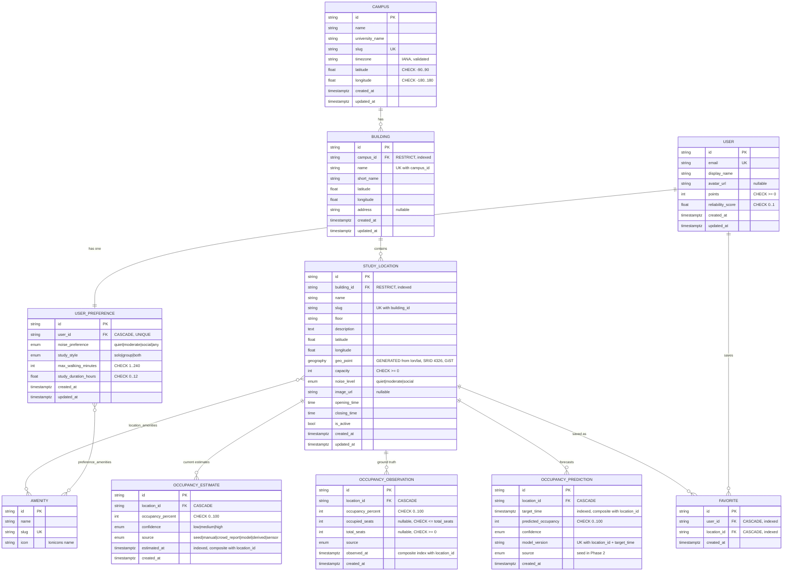

# StudySpot database

PostgreSQL 17 with PostGIS 3.5. Every table is created by Alembic revision `0001`; nothing relies on
`Base.metadata.create_all()`. Identifiers are opaque `VARCHAR(64)` strings so seeded records can keep
the Phase 1 zone ids (`zone-1` … `zone-12`) while later rows default to a UUID.

## Entity relationships

## Why the tables look like this

- **A study location is a zone, not a building.** `Fenwick Library · Floor 4` is one
  `study_locations` row pointing at the `fenwick-library` building. Uniqueness is
  `(building_id, slug)`, so `floor-4` may repeat across buildings.
- **`geo_point` is generated, never written.** It is a `GENERATED ALWAYS AS
  ST_SetSRID(ST_MakePoint(longitude, latitude), 4326)::geography STORED` column with a GiST index
  (`ix_study_locations_geo_point`). Application code only ever writes `latitude`/`longitude`, so the
  point can never drift out of sync. Phase 4 radius search (`ST_DWithin`) can use the index as is.
- **Three occupancy tables, three jobs.** `occupancy_estimates` is what the app shows now;
  `occupancy_observations` is ground truth for future model training and powers the "Recent
  observations" chart; `occupancy_predictions` stores forecasts. All three carry a `source` enum, and
  everything the seed writes is `source = 'seed'`. Nothing in Phase 2 is a live reading or an ML
  output.
- **Enums are non-native with check constraints** (`native_enum=False`), so adding a value in Phase 5
  or 7 is an ordinary constraint change rather than a `CREATE TYPE` migration dance.
- **Deletes are deliberate.** Reference data uses `ON DELETE RESTRICT` (a campus cannot be deleted out
  from under its buildings); user-owned and telemetry rows use `ON DELETE CASCADE`.
- **Constraint names are conventional.** `Base.metadata` carries a naming convention
  (`ck_%(table_name)s_%(constraint_name)s` and friends), which is what keeps `alembic check` from
  reporting phantom drift.

## Indexes

| Index | Purpose |
| --- | --- |
| `ix_buildings_campus_id` | Buildings for one campus |
| `ix_study_locations_building_id` | Zones for one building |
| `ix_study_locations_geo_point` (GiST) | Phase 4 proximity search |
| `ix_estimates_location_time` | Latest estimate per zone |
| `ix_occupancy_estimates_estimated_at` | Time-window scans |
| `ix_observations_location_time` | Recent observations per zone |
| `ix_predictions_location_time` | Forecast window per zone |
| `ix_occupancy_predictions_target_time` | Forecast horizon scans |
| `ix_favorites_user_id`, `ix_favorites_location_id` | Favorites both directions |

Unique constraints do the rest: `campuses.slug`, `amenities.slug`, `users.email`,
`user_preferences.user_id`, `(campus_id, name)` on buildings, `(building_id, slug)` on locations,
`(user_id, location_id)` on favorites, `(location_id, target_time, model_version)` on predictions.

## Occupancy classification

One definition, in `backend/app/utils/occupancy.py`, mirrored by `mobile/utils/occupancy.ts`:

| Percent | Level |
| --- | --- |
| 0–39 | `available` |
| 40–64 | `moderate` |
| 65–84 | `busy` |
| 85–100 | `full` |

The API returns the classified `level` alongside `percent` so the mobile client never re-derives
thresholds, and `tests/test_api.py::test_classification` pins every boundary.

## Seed contents

`backend/app/seed/run.py` reads `backend/app/seed/phase1.json`, which is exported from the Phase 1
dataset (`mobile/mocks/locations.ts`) — there is no second, divergent dataset. One run produces:

| Table | Rows |
| --- | --- |
| `campuses` | 1 (GMU Fairfax) |
| `buildings` | 5 (Fenwick Library, Horizon Hall, Johnson Center, SUB I, Peterson Hall) |
| `amenities` | 8 |
| `study_locations` | 12 |
| `occupancy_estimates` | 12 |
| `occupancy_observations` | 96 (8 per zone) |
| `occupancy_predictions` | 48 (4 per zone) |
| `users` | 1 (`dev@studyspot.local`) |
| `user_preferences` | 1 |
| `favorites` | 2 |

Seeding is idempotent and takes a transaction-scoped advisory lock. Reference rows are created only
when absent, so edits made through the API survive; `source = 'seed'` telemetry is deleted and
rewritten each run, which is also how expired demo forecasts get refreshed. Observed and predicted
times are re-anchored to the run time — the estimate at "now", observations every two hours back, and
forecasts on the next four hour boundaries.
